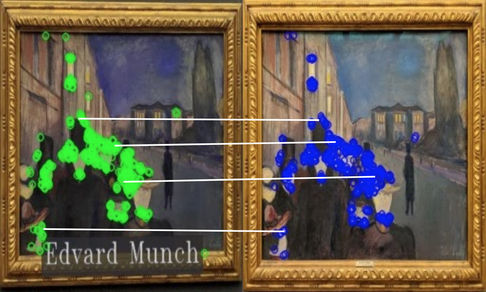

# Museum Painting Retrieval

### [Paper](https://arxiv.org/abs/2105.04891)

## Summary
This repository contains the code related to the project on 'Museum Painting Retrieval' of the [Module 1: Introduction to Human and Computer Vision](https://pagines.uab.cat/mcv/content/m1-introduction-human-and-computer-vision) of the Master in Computer Vision at UAB. 

The aim of this master module is to implement a query by example CBIR system for finding paintings in a museum image collection using color, texture, text and feature descriptors in datasets with different perturbations in the images: noise, overlapping text boxes, color corruption and rotation.

The module consists of 5 different deliveries that build up to a complete pipeline.

* [Week 1](https://github.com/IanRiera/MCV-M1-Museum-Painting-Retrieval/tree/main/week1)
* [Week 2](https://github.com/IanRiera/MCV-M1-Museum-Painting-Retrieval/tree/main/week2)
* [Week 3](https://github.com/IanRiera/MCV-M1-Museum-Painting-Retrieval/tree/main/week3)
* [Week 4](https://github.com/IanRiera/MCV-M1-Museum-Painting-Retrieval/tree/main/week4)
* [Week 5](https://github.com/IanRiera/MCV-M1-Museum-Painting-Retrieval/tree/main/week5)

## Contributors: Team 3
- Òscar Lorente Corominas ([email](mailto:oscar.lorentec@e-campus.uab.cat))
- Ian Riera Smolinska ([email](mailto:ianpau.riera@e-campus.uab.cat))
- Shauryadeep Chaudhuri ([email](mailto:shauryadeep.chaudhuri@e-campus.uab.cat))
- Oriol Catalan ([email](mailto:oriol.catalan@e-campus.uab.cat))
- Víctor Casales ([email](mailto:victor.casales@e-campus.uab.cat))
